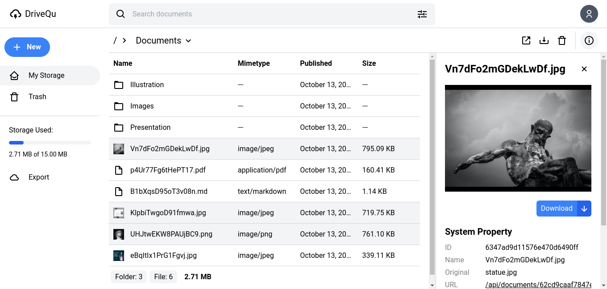

# Storage Service
Storage service (Cloudipati) is a web-based cloud storage service that is accessed online and can be integrated with various platforms such as web and mobile. Any user can connect his application with this cloud service through the API.

The technology stack I used on this project includes:
  - React.js
  - Tailwind CSS
  - Node.js & Express.js
  - MongoDB
  - Webpack

# Getting Started
> Note: This project is still in progress, therefore all existing components are temporary and may change in the future.

~~~
$ git clone https://github.com/febriadj/storage-service.git

$ cd storage-service && code .
~~~
~~~
$ mv .env.example .env
~~~
Rename the .env.example file to .env

~~~
$ npm install
~~~
Install all dependencies on this project.

~~~
$ npm run dev
~~~
Run the app in development mode. then open http://localhost:3000 in the browser.

# Screenshot 📸

# Contributing
Contributions make the open source community a great place to learn, inspire and create. I really appreciate every contribution you make.

If you have any suggestions that would make this even better, please fork this repo and pull request. You can also open an issue on this project and don't forget to give this project a star. Thank you.

- Fork this project
- Create a new branch (git checkout -b branchName)
- Commit your changes (git commit -m "Add new features")
- Push to your branch (git push origin branchName)
- Submit a pull request

# License 📄
Distributed under the MIT License. See [LICENSE.txt](https://github.com/febriadj/storage-service/blob/master/LICENSE) for more information.

# Contact
LinkedIn: [linkedin.com/in/febri-adji](https://linkedin.com/in/febri-adji)

Phone: +62 851-5670-3982\
Email: <iamfebriadji@gmail.com>
